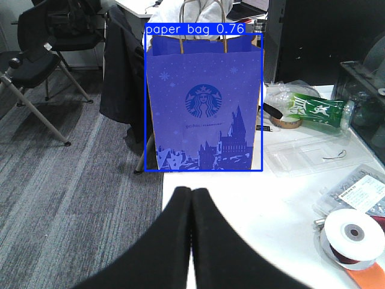
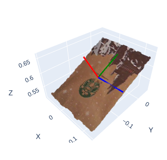

## 项目简介


> 基于 RGB-D 点云与 SAM3 语义分割的咖啡袋位姿估计与机械臂抓取系统。

  
*掩码图像：通过语义分割提取出的咖啡袋区域（蓝色）。*

  
*原始深度图：由 Orbbec Dabai 相机获取的场景深度信息，用于后续点云重建。*

  
*3D 点云：基于 mask 和对齐后的 RGB-D 数据生成的点云，用于位姿估计与抓取规划。*

  
*抓取演示动画（2倍速）：机械臂根据检测到的咖啡袋位姿，自主完成接近、夹取与提起。*

---


## 📦 安装

### 1. 安装依赖

本项目依赖以下外部仓库，请确保在构建前正确克隆并安装它们：

| 仓库 | 说明 |
|------|------|
| [`agilexrobotics/piper_sdk`](https://github.com/agilexrobotics/piper_sdk) | Piper 机械臂的底层 CAN 通信 SDK |
| [`orbbec/OrbbecSDK_ROS2`](https://github.com/orbbec/OrbbecSDK_ROS2/tree/main) | Orbbec 深度相机的 ROS 2 驱动 |
| [`orbbec/OrbbecSDK`](https://github.com/orbbec/OrbbecSDK) | Orbbec 深度相机的底层 SDK |
| [`moveit/moveit2`](https://github.com/moveit/moveit2) | ROS 2 下的通用机械臂控制框架 |
| [`binb1nwu/trac_ik`](https://github.com/binb1nwu/trac_ik) | 逆运动学求解器 TRAC-IK 的 ROS 2 移植版 |
| [`binb1nwu/nlopt`](https://github.com/binb1nwu/nlopt) | 修改安装前缀的 NLopt 非线性优化库 |


### 2. 安装本项目

首先克隆本项目及其子模块，子模块基于 [`agilexrobotics/piper_ros`](https://github.com/agilexrobotics/piper_ros/tree/humble) 增加了 `moveit_py` 控制机械臂

```bash
git clone --recurse-submodules https://github.com/Ironlings/CoffeeGrasp.git
```
然后分别进入 `coffee_ws` 和 `piper_ros` 进行编译

### 3. 配置 SAM 3

为避免干扰 ros2 环境，请先安装 conda，然后创建新的虚拟环境

```bash
conda create -n sam python=3.10
```

SAM 3 在 Ultralytics 8.3.237 版本及更高版本中可用。通过以下方式安装或升级：

```bash
pip install -U ultralytics
```
下载 [`SAM 3`](https://huggingface.co/facebook/sam3) 所需模型权重后，在 `coffee_ws/src/config/params.yaml` 中配置模型权重路径

---

## 运行

### 1. 激活 ROS 2 环境  
确保已正确 `source` 所有 ROS 2 工作空间的依赖环境（如 `/opt/ros/humble/setup.bash` 及自定义工作空间的 `install/setup.bash`）。

### 2. 启动节点

依次运行以下命令以启动感知、机械臂控制与抓取规划模块：

```bash
# 启动 Orbbec Dabai 相机驱动（启用深度-彩色对齐）
ros2 launch orbbec_camera dabai.launch.py depth_registration:=true

# 启动 Piper 机械臂（指定 CAN 接口及夹爪开合倍率）
ros2 launch piper start_single_piper.launch.py can_port:=can_piper gripper_val_multiple:=2

# 启动 MoveIt! 运动规划与末端执行器位姿接收
ros2 launch piper_with_gripper_moveit mydemo.launch.py
```

随后，在新终端中激活 `sam` Conda 环境并运行咖啡袋检测和抓取节点：

```bash
conda activate sam
ros2 launch coffee_detect coffee.launch.py
```

> **提示**：建议在不同终端窗口中分别运行上述命令，便于日志监控与调试。

---